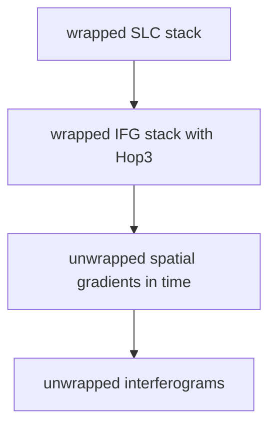

# 3D Phase unwrapping using Extended Minimum Cost Flow (EMCF)

`spurt` includes an implementation of the EMCF algorithm [@Pepe2006ExtensionMinimumCost].

## Data flow

```mermaid
graph TD
    A[wrapped SLC stack] --> B[wrapped IFG stack with Hop3]
    B --> C[unwrapped spatial gradients in time]
    C --> D[unwrapped interferograms]
```

## Pseudo-code description
