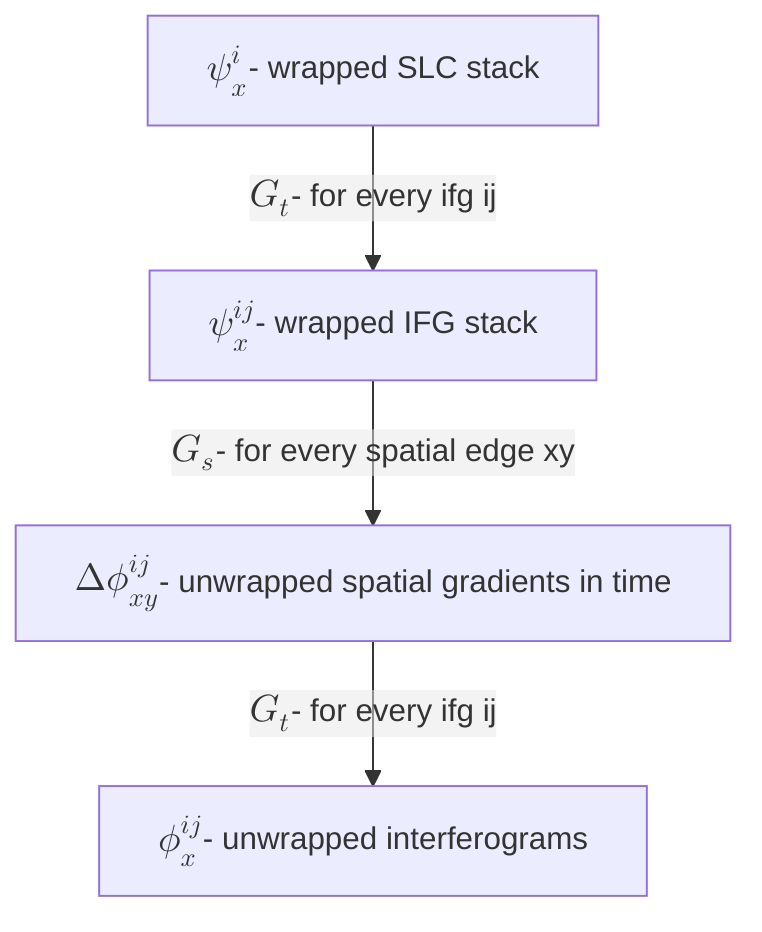

# 3D Phase unwrapping using Extended Minimum Cost Flow (EMCF)

`spurt` includes an implementation of the minimum cost flow component of the EMCF algorithm [@Pepe2006ExtensionMinimumCost]. In this approach, the 3D unwrapping problem is approximated by two-stage 2D unwrapping problems. In the first stage, double difference phases are unwrapped in temporal domain (Time-Bperp space) using conventional 2D MCF solvers to generate unwrapped spatial gradients in each interferogram in the network. These unwrapped gradients are then spatially unwrapped using conventional 2D MCF solvers to generate unwrapped interferograms.

## Data flow

Let $G_s$ and $G_t$ represent the planar graphs in spatial domain (typically a Delaunay triangulation) and temporal domain (typically a Hop3 graph or a Delaunay in time-Bperp space).



## Example 3D EMCF

``` py
# cslc is a 3D array of type np.complex64 and shape (n_sar, n_pts)
# xy is a n_pts x 2 array with coordinates of pixels

# Set up time processing
g_time = spurt.graph.Hop3Graph(cslc.shape[0])
s_stime = spurt.mcf.ORMCFSolver(g_time)

# Set up spatial processing
g_space = spurt.graph.DelaunayGraph(xy)
s_space = spurt.mcf.ORMCFSolver(g_space)

# Create EMCF solver
settings = spurt.workflows.emcf.SolverSettings(t_worker=1)
solver = spurt.workflows.emcf.Solver(s_space, s_time, settings)

w_data = spurt.io.Irreg3DInput(
    cslc, g_space.points
)
uw_data = solver.unwrap_cube(w_data)

```


## Things to do

- DEM error correction prior to unwrapping

While our implementation has the hooks to estimate and correct for DEM errors during the temporal unwrapping step, we have not tested this extensively and have turned it off by default for now. We are currently focused on working with Sentinel-1 data which is characterized by small orbital baseline tube. We expect this to be important for data from other sensors.

- Impact of cost functions

In general, impact of cost functions on the various unwrapping steps are less well understood for EMCF and 3D unwrappers than 2D unwrappers like Snaphu.
