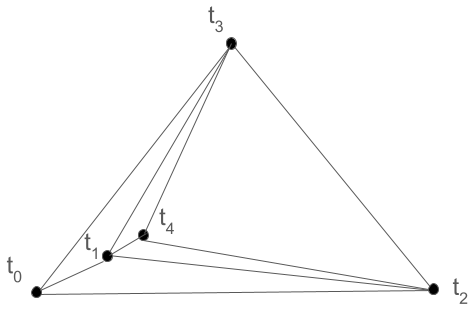

# Planar graph

A planar graph is a graph that can be drawn on a plane in such a way that its edges intersect only at their end point, i.e, its edges do not cross each other. In the context of this package, we assume that planar graphs are connected and all cycles in a planar graph are of the same length. Planar graphs satisfy Euler's formula

$$
   v - e + f = 2
$$

where $v$ is the number of vertices, $e$ is the number of edges and $f$ is the number of faces in the graph.

We implement a generic interface for a planar graph via `spurt.graph.PlanarGraphInterface`. We support the following types of planar graphs in `spurt`.


## Regular 2D grid graph

This corresponds to a regular 2D grid underlying the classical Minimum Cost Flow (MCF) problem [@Costantini1998MinimumCostFlow]. Each cycle in this planar graph is of length 4. We can create a regular grid 2D graph using

``` py
g = spurt.graph.Reg2DGraph((nlines, npixels))
```


## Irregular 2D grid graph

This corresponds to an irregular 2D grid underlying the sparse MCF problem [@Costantini1999SparseMCF]. A Delaunay triangulation for a sparse grid can be created as follows

``` py
g = spurt.graph.DelaunayGraph(coords)
```

where coords is a `Npts x 2` numpy array.


## Hop3 graph

This is a graph that is primarily used with phase-linked stacks of narrow baseline SAR sensors like Sentinel-1 and NISAR during temporal unwrapping. It is meant to be a replacement to the Delaunay graph used in the temporal dimension in the original EMCF method [@Pepe2006ExtensionMinimumCost]. In a Hop3 graph each SAR image is connected to three acquisitions before and after it in time.

The Figure below shows how such a connected network of interferograms can always be generated by placing the node corresponding to acquisition $t_i$ inside the triangle represented by nodes $t_{i-3}$, $t_{i-2}$ and $t_{i-1}$ on a plane.

<figure markdown="span">
  
  <figcaption>A Hop-3 network rendered as a planar graph. Each node is a SAR acquisition and each edge is an interferogram.
</figure>
